

  Language:
  🇺🇸
  <a title="Chinese" href="/README_CN.md">🇨🇳</a>

# Intelligent Vehicle Stream(IVS)

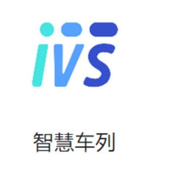

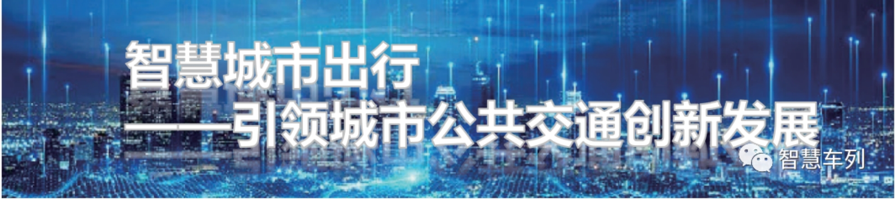

The smart city travel public transportation system is guided by passenger demand. According to urban planning and travel heat demand, relying on passenger flow corridors to establish the backbone lines of the smart train transportation system, expand the network to cover all travel areas in the city, and build a "backbone line + expansion network". A new generation of quality public transportation system. Digitally upgrade traditional ground steam-electric buses to provide passengers with better guaranteed travel services. "Security + Quality" urban public transportation system realizes intensive travel mode, taking into account personalized travel needs, creating a flexible bus supply model, and improving the quality and competitiveness of urban public transportation services.

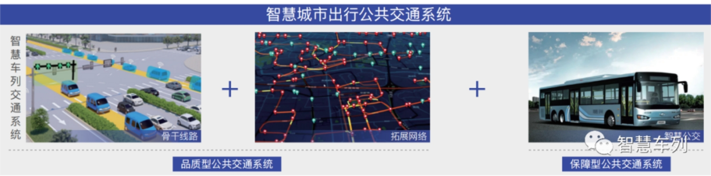 

The smart city travel public transportation system realizes the integration and coordination of people, vehicles, roads and clouds based on 4G/5G networks, and innovatively establishes an urban public transportation operation organization model with demand perception, demand analysis, demand response, and Data Analysis decision-making as the logic. The system is highly networked and intelligent.

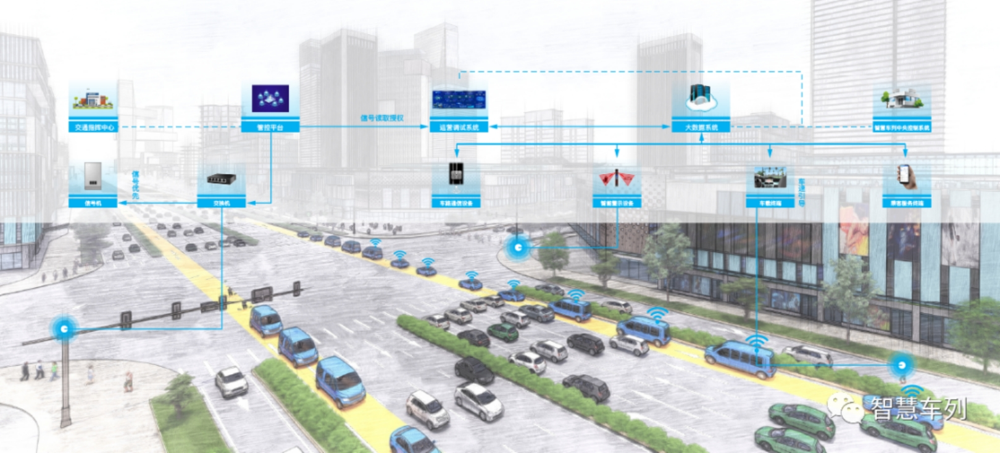 

**Brand new travel service experience **
Truly realize the "people-oriented" public transportation travel service, and create a beautiful urban travel to meet the travel needs of passengers "all scenarios, all types, OurHours, and all regions".

◆ More convenient and efficient way to travel;

◆ More comfortable travel services;

◆ More cost-effective travel options;

 

**▶ reservation itinerary **

🥰 Convenient appointment:

Passengers can book a trip through the APP or platform intelligent end point, and travel calmly by APP to predict the itinerary information.

A variety of options:

Provide guaranteed and comfortable travel services covering different travel needs, which can not only provide low-cost guaranteed travel services, but also provide high-quality travel services at reasonable prices.

🥰 Safe and caring:

Provide care services for specific needs such as children going to school and the elderly traveling, and travel information is fed back to guardians in real time through APP, which is safe and controllable.

 

**▶ waiting for ticket inspection **

High site coverage:

Set up stations according to travel needs Big data to make up for the shortcomings of traditional bus and subway stations, such as low coverage rate and unreasonable site location, and solve the problem of travel "last mile".

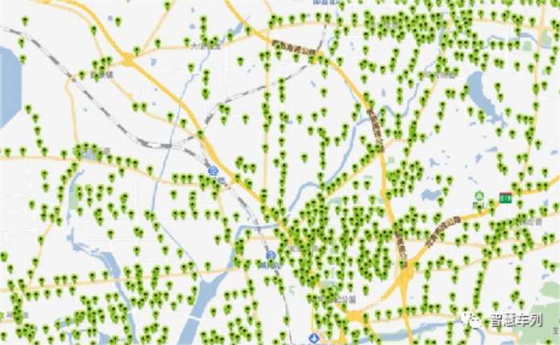 

🥰 Itinerary forecast:

The arrival time of traditional buses is inaccurate and the waiting time is long. However, the vehicle location information of the smart city travel system can be controlled in real time. Passengers only need to arrive at the station 2 minutes in advance according to the vehicle trajectory, and the platform environment is comfortable, saying goodbye to the anxiety of waiting for the bus.

🥰 Convenient ride:

The station is set up close to the community, schools, and shopping malls. Passengers wait on the ground platform, and the system dispatches vehicles to the platform to pick up and drop off passengers. On the other hand, rail transit passengers need to enter the underground station or air station, and the waiting mode adopts the "people catch the car" mode, and the station transfer is cumbersome.

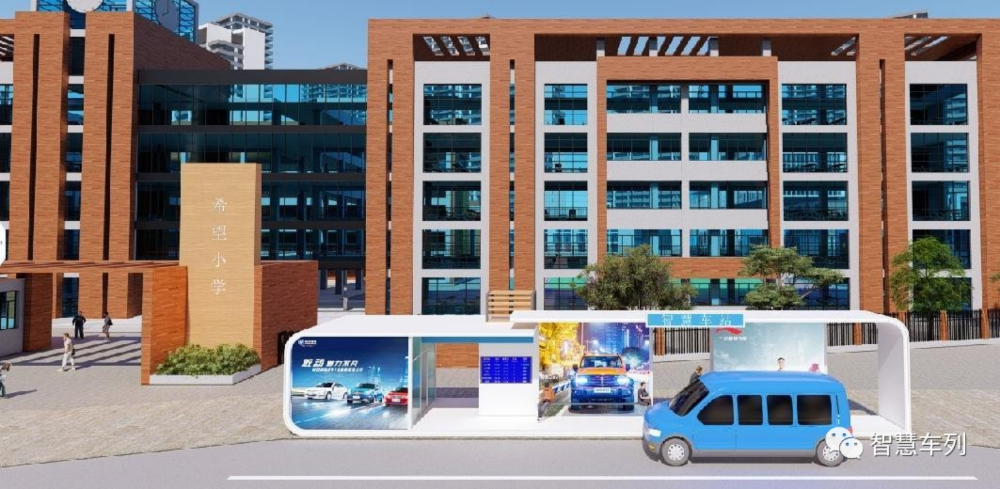 

 

**▶ Quality Travel **

Everyone has a seat:

The custom-developed new model brings a comfortable ride experience. If the reservation is successful, everyone will have a seat and bid farewell to the embarrassment of crowding the bus.

🥰 Convenient and direct access:

Big data intelligent matching will take passengers who leave and arrive at the same station at the same time in the same car, using the "point-to-point" service mode, which is convenient and direct, saying goodbye to the traditional bus and subway cumbersome transfer and "stop at station" travel mode, greatly saving travel time.

🥰 Efficient and smooth:

Right of way guarantee + signal priority, travel speed up to 60-80km/h, compared with traditional bus and subway 15-25km/h running speed, greatly improve travel speed, punctual and safe; faster than private car travel, especially during peak hours The advantages are more obvious, and the travel cost is much lower than driving a private car.

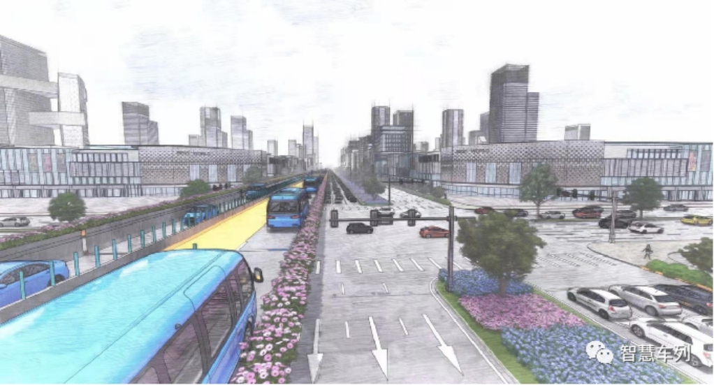 

**Socioeconomic Benefits **

Reorganize existing urban public transportation resources with informatization and intelligence, improve the core indicators of urban public transportation system operating enterprises, reduce operating costs, and increase operating income. Operation scheduling is smarter, system operation is safer, and management decision-making is more scientific.

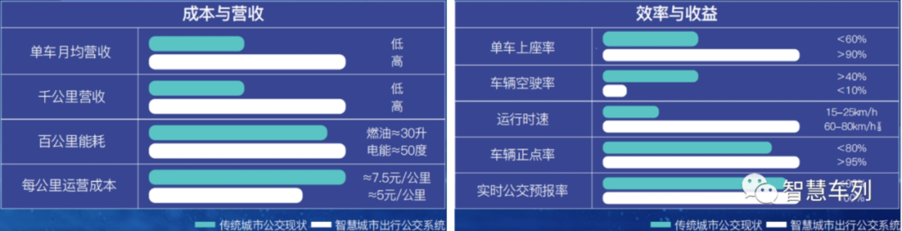 

Urban transportation affects economic development. After the smart city travel public transportation system is completed and put into operation, it will promote the transformation of urban public transportation travel services from "basic travel guarantee" to "meeting multi-level travel demand", realize the innovation and improvement of urban public transportation resource supply, and urban public transportation. The speed of the city-wide public transportation has been greatly improved, and the quality of public transportation has been greatly improved, and the urban "guarantee + quality" public transportation system has been built to meet the diverse travel needs of citizens. As a result, more citizens will be attracted to give up private cars and choose public transportation. The proportion of public transportation travel will further increase, and urban road traffic congestion will be greatly alleviated, reducing traffic carbon emissions and helping the "double carbon goal". And help reduce the government's financial expenditure on public transportation.

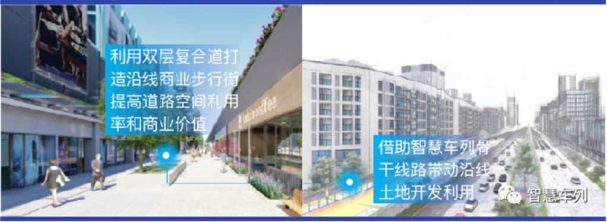 

The smart train transportation system provides more cities with a solution to guide urban development with road public transportation. Like rail transit, the smart train transportation system can effectively drive the development and utilization of land along the line. With the smart train transportation system as the backbone + TOD model, the advantages of land location along the line will be further highlighted, and the attractiveness of commercial investment and development along the line will be greatly enhanced, which is conducive to promoting urban development planning and land development and utilization.

Smart city travel public transportation system as a new generation of urban intelligent transportation system , covering many upstream and downstream segments of the industry, with the help of smart city travel public transportation system construction landing linkage effect, the establishment and improvement of related transportation industry clusters, the overall output value of more than 100 billion.

 

# User operation mode

(1) WeChat official account/Mini Program search "smart car train"

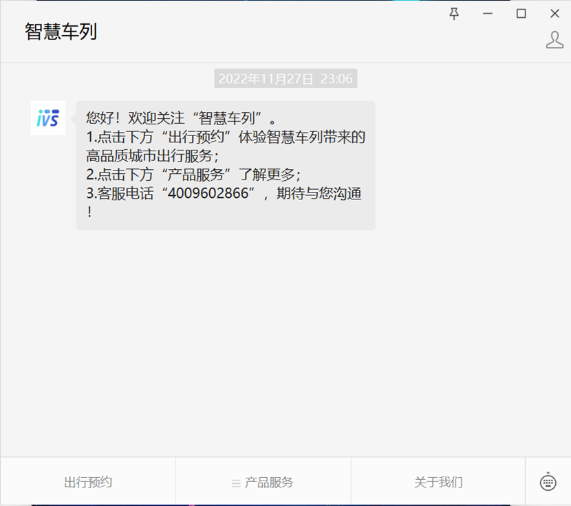

(2) Click to book a trip, or open the Smart Train Mini Program and select your city

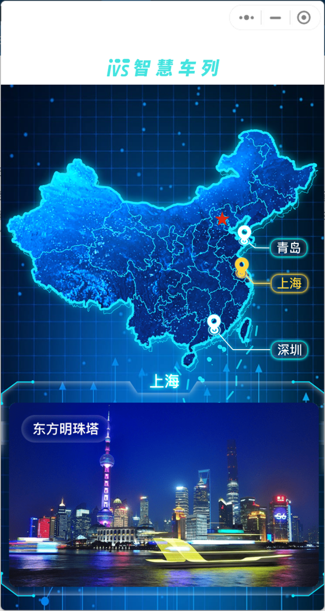

Smart train ride interface display:

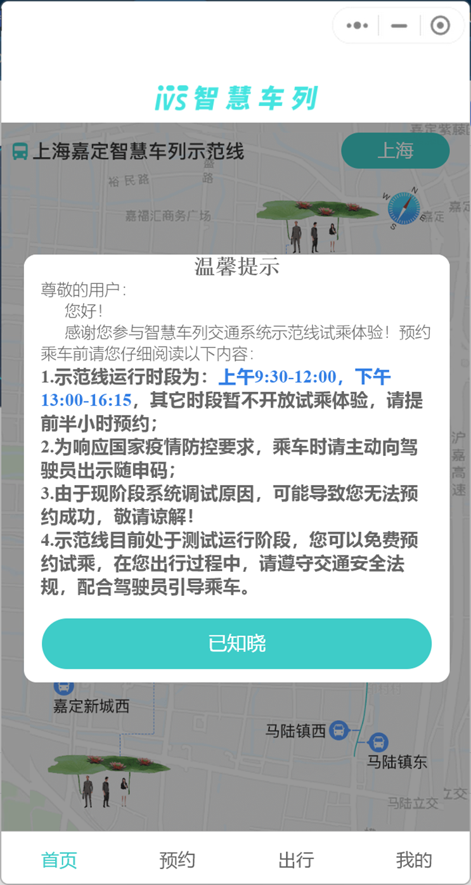

(3) Click Reservation, select the departure site and the end site, and select the corresponding ride time:

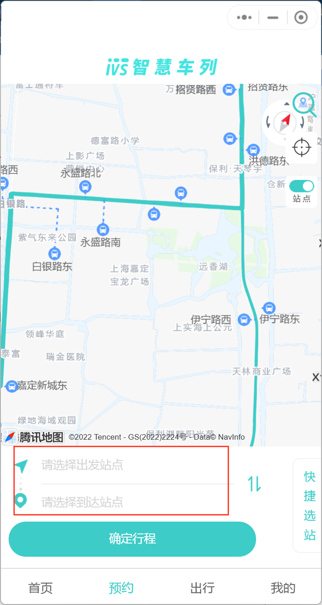

 

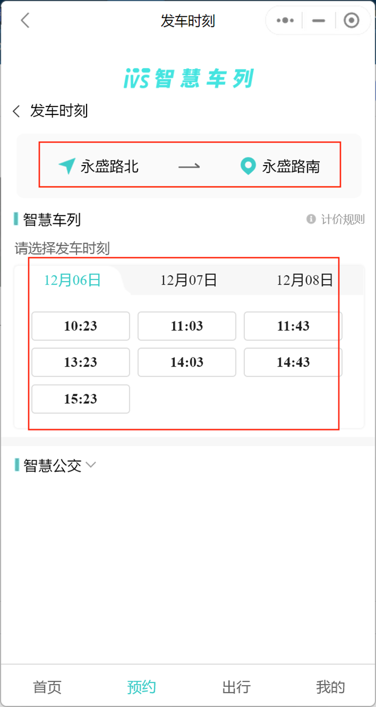

(4) After the reservation is successful, your corresponding order will be generated, and you can experience this product according to the order information

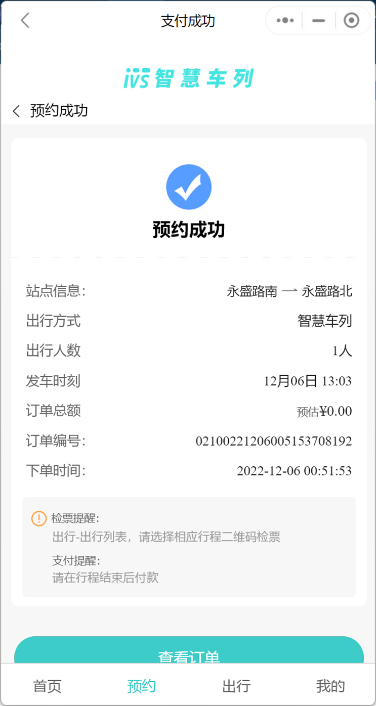

(5) During the trip, you can check the confirmed order:

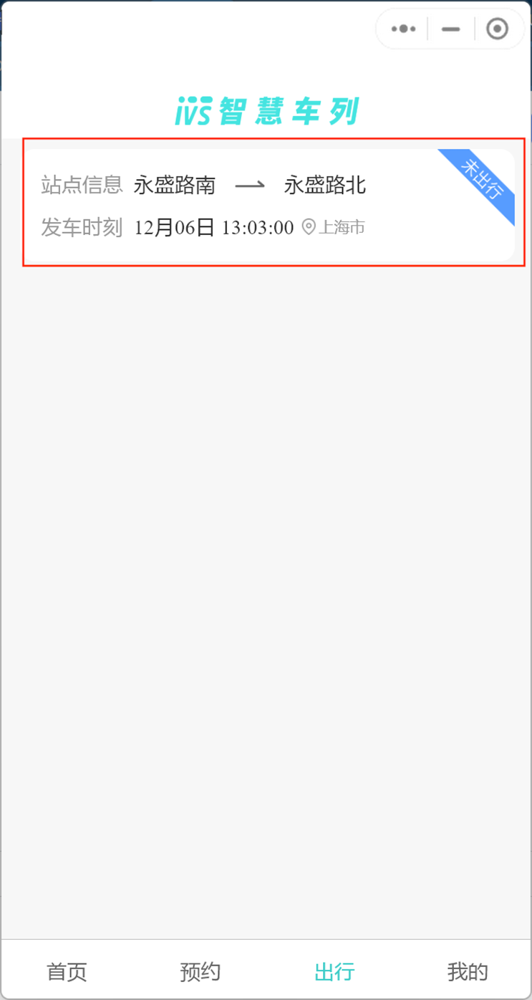

# Documents

<a title="Chinese" href="/SystemEcology.md">Technology and System Ecology</a>

# Contact the platform

**Share QR code -**

**Micro Signal - gh_8e300cd53581**

Function Introduction Courtesy life, enjoy good travel: share industry information, advocate intensive, green and low-carbon travel concept; smart city travel public transportation system based on the backbone construction of smart train transportation system, expand the network to cover the entire urban travel demand area, provide citizens with safe, comfortable, efficient and environmentally friendly travel services, help solve urban traffic congestion, create a better city travel.

 