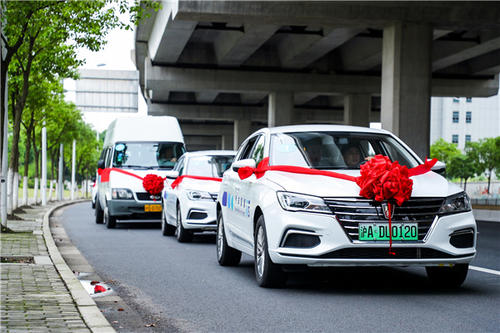
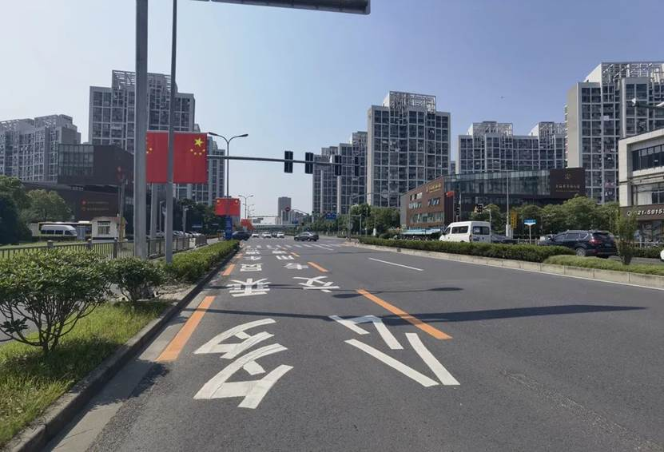

# 产品介绍

地铁运营成本高，公交出行速度慢 城市交通“痛点”如何解决？

近期在嘉定沪宜公路正式开通的智慧车列交通系统示范线给出了新的解决方案。该方案用智能网联、大数据、人工智能等前沿科技，把传统城市公共交通资源“蝶变”成新一代中、大运量城市骨干交通系统，融公路交通灵活性与轨道交通大运量优势于一体，将更安全、舒适、高效、环保。

智慧车列已在嘉定试行

海岸君近日在嘉定新城发现，沪宜公路上的公交专用车道上，与“公交专用车道”并排提醒的，还有一行字：“多乘员车道。”

与此同时，沪宜公路公交专用车道正上方的告示牌显示，7:00-10:00与16:00-19:00这两个高峰时间段，可以在公交专用车道上通行的车辆，除了公交车外，乘员数量两人及两人以上的车辆均可以通行。

智慧车列9:50-10:50与15:00-16:00利用多乘员车道在沪宜公路开展测试运行，测试完成后，将调整运行时间为市民提供出行服务。智慧车列交通系统由中国工程院总策划，同济大学、清华大学、湖南大学等高校科研力量与高科技企业协同创新，德鑫智慧科技（上海）有限公司进行产业化开发和推广应用。

# 用户操作方式

（1）微信公众号/小程序搜索“智慧车列”

（2）点击预约出行，或打开智慧车列小程序，选择您所在的城市

智慧车列乘车界面展示：

（3）点击预约，选择出发站点和结束站点，并选择对应乘车时间：

 

（4）预约成功之后，将会生成您的对应订单，根据订单信息即可体验本产品

（5）在出行当中，即可查看已经确定的订单：

# 联系平台

**分享二维码——**

**微信号——gh_8e300cd53581**

功能介绍礼遇生活、享受美好出行：分享行业资讯，倡导集约化、绿色低碳出行理念；智慧城市出行公共交通系统基于智慧车列交通系统骨干建设，拓展网络覆盖整个城市出行需求区域，为市民提供安全、舒适、高效、环保的出行服务，助力解决城市交通拥堵，开创城市美好出行。

 
