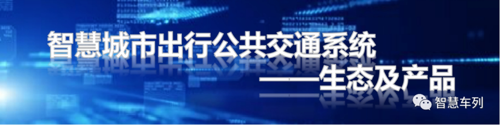
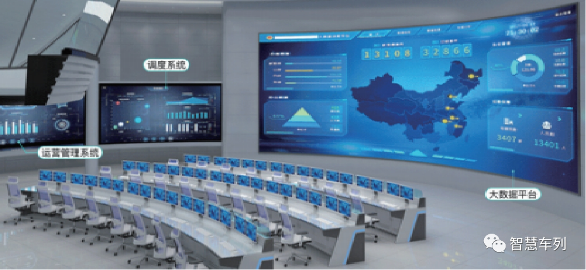
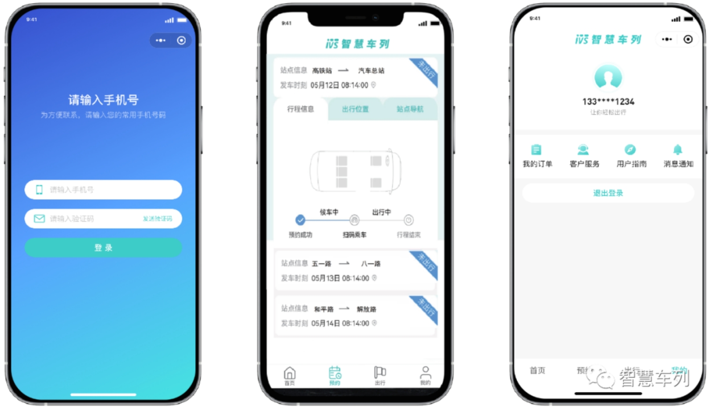
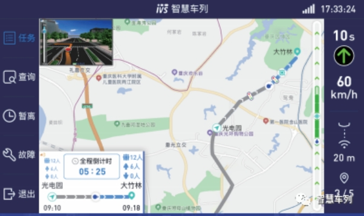
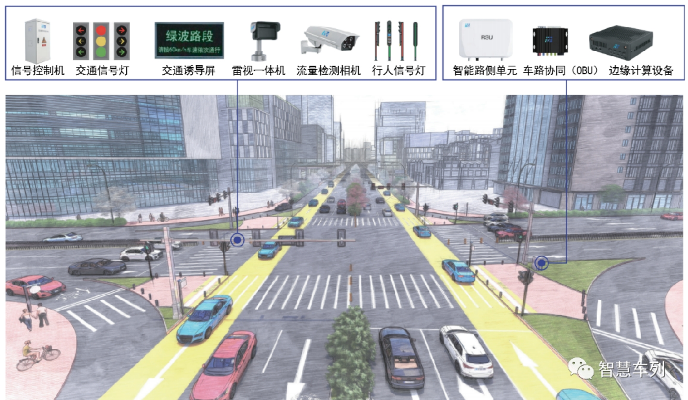
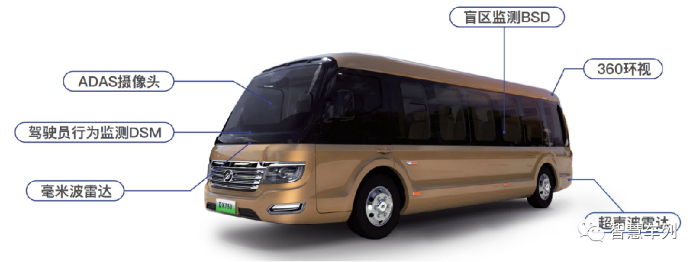
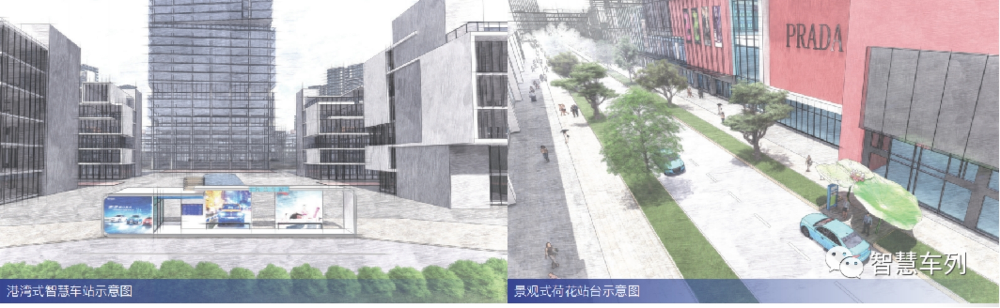

# System Ecology

**Platform and Software Ecology**
Build an ecosystem of information connectivity and interaction platforms for different traffic entities such as operating companies, drivers, passengers, roads, and equipment, which can be customized and developed according to the needs of operating companies.

 

**▶ central control system**

As the intelligent brain of the platform ecosystem, it consists of a dispatch system (DS), a Big data platform (BDP) and an operation management system ( OMS ). It mainly realizes functions and services such as path planning, OD itinerary matching, emergency scheduling, basic data management, operation data lake visualization, and statistical analysis visualization.

 

**▶ Passenger Service System**

It mainly provides services such as ticket purchase, route inquiry, travel navigation, car scanning, payment, social networking, information, and real-time public transportation.

 

**▶ Driver Operating System (APP)**

It mainly provides services such as task viewing, vehicle (column) guidance, information inquiry, temporary departure, and calling.

 

**Intelligent Roadside Information System**
It is composed of intelligent side devices such as traffic signal control equipment, traffic guidance equipment, intelligent traffic perception equipment, intelligent pedestrian integrated signal lights, and vehicle-road coordination equipment. It is mainly used for perception, collection, data interaction, and control decision-making to realize the integration of people, cars, roads, and clouds.

 

 

**Traffic Signal Priority System Scheme**

Passive Priority Green Wave

Flexible use of green wave control technology to achieve multi-line, multi-time refined passive priority green wave control, the construction of urban traffic travel main corridor, so that the city blood flow more smoothly, more efficient traffic travel.

Active priority green wave

Based on AI , Deep learning, EdgeComputing, C-V2X and other technologies and the "cloud-side-end" architecture, with EdgeComputing as the core, it refines the active priority control decision-making, rationally allocates the priority right of way of the road, makes the best use of the road, and the car travels smoothly, creating a new experience of smart transportation.

Self-Adaptation Priority Green Wave

Based on AI , Cloud Service, Big data and C-V2X and other technologies, build a "person-vehicle-road-cloud" integrated and coordinated intelligent transportation system. Global traffic data perception, precise signal timing control, and achieve regional optimal Self-Adaptation priority control, improve the level of road intelligence, and enjoy intelligent travel.

 

**Intelligent Connected Vehicles and Onboard Devices**
The intelligent networked vehicle system is a new generation of urban transportation system that is gradually transformed from a separate means of transportation to an intelligent mobile space. Based on the design concept and technical platform of sedan-ization, the vehicle riding comfort reaches the quality of a car, and the space feeling meets the requirements of a high-end passenger car. Equipped with advanced on-board sensors and controller equipment systems such as vehicle-road coordination OBU , new energy end point T-box, and on-board end point host, it realizes intelligent information interaction and sharing. The power types are: pure electric, extended range, and hydrogen fuel cells, covering 5-seat, 15-seat, and 22-seat models.

 

**Staged technology iterative upgrade**

 

**Smart Stations and Equipment**
The smart station adopts Modularization design, intelligent integration, more efficient pick-up and drop-off, providing passengers with a convenient and comfortable waiting environment. At the same time, it provides expanded business services. Optional functional modules include platform passenger service screens, intelligent electronic station signs, unmanned ticket vending machines, video surveillance and alarm equipment, EA IOT Lighting facilities, air conditioning and ventilation equipment, etc. The station video system can be used as a public security network to help build a city's intelligent security network.

 

**▶**Harbor-style smart station can be used for the construction plan of the backbone line of smart trains. It is smarter and more convenient than the traditional harbor-style bus station, with high space utilization, and can also increase the commercial expansion area as needed.

▶ landscape lotus station can be used for branch line and expand the network site construction program, covers an area of small, beautiful appearance, can be integrated with the urban landscape design and construction.

 

▶ large-scale smart stations can be used for the construction of important transportation hubs such as airports and high-speed rail stations. The spatial layout is more optimized, the functions are complete, and the degree of intelligence is high.

 