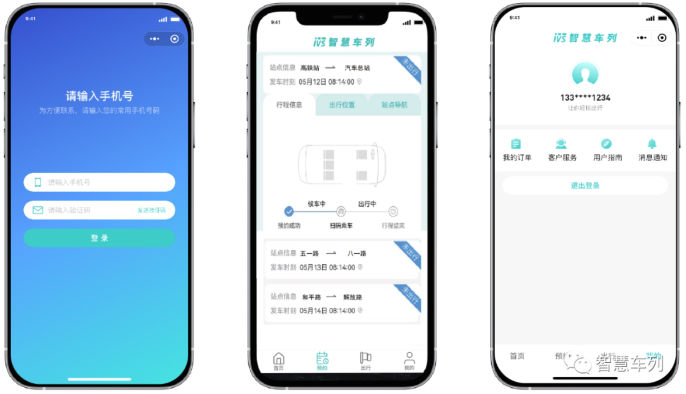
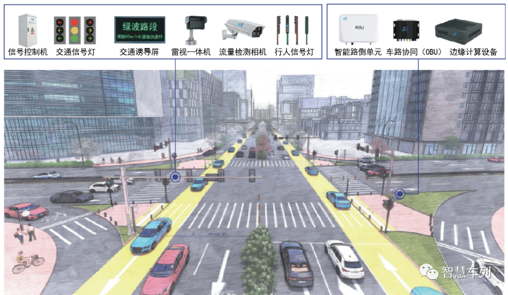
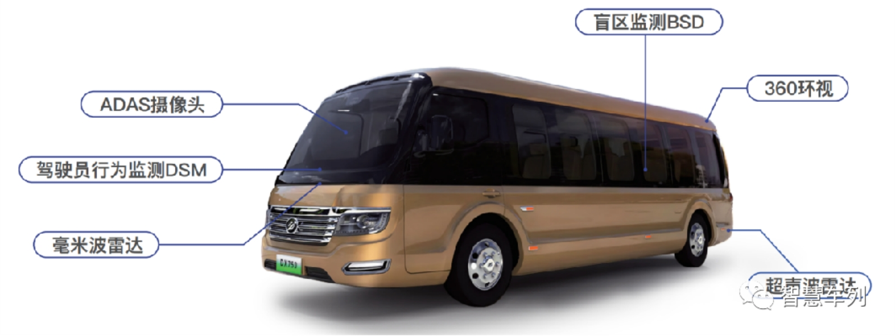

# System Ecology

 

**平台及软件生态**
构建运营企业、驾驶员、乘客、道路、设备等不同交通主体的信息联通和交互平台生态，可根据运营企业需要定制开发。

 

**▶中央控制系统**

   作为平台生态的智慧大脑，由调度系统（DS）和大数据平台（BDP）以及运营管理系统（OMS）构成。主要实现路径规划、OD行程匹配、应急调度以及基础数据管理、运营数据可视化、统计分析可视化等功能和服务。

 

**▶乘客服务系统**

   主要提供购票、线路查询、出行导航、乘车扫码、支付、社交、资讯、实时公交等服务。

 

**▶驾驶员操作系统（APP）**

   主要提供任务查看、车辆（列）引导、信息查询、暂离、呼叫等服务。

 

**智能路侧信息系统**
由交通信号控制设备、交通诱导设备、智能交通感知设备、智慧行人一体化信号灯、车路协同设备等智能边端设备构成，主要用于感知、采集、数据交互、控制决策，实现人、车、路、云一体化协同。

 

 

**交通信号优先系统方案**

◉被动优先绿波

   灵活运用绿波控制技术，实现多线路、多时段精细化被动优先绿波控制，建设城市交通出行主廊道，让城市血液流通更顺畅，交通出行更高效。

◉主动优先绿波

   基于AI、深度学习、边缘计算和C-V2X等技术与“云-边-端”架构，以边缘计算为核心，精细化主动优先控制决策，合理分配道路优先通行权，路尽其用、车畅其行，打造智慧交通出行新体验。

◉自适应优先绿波

   基于AI、云计算、大数据和C-V2X等技术构建“人—车—路—云”一体化协同的智慧交通出行系统。全局交通数据感知，精准信号配时调控，实现以区域最优的自适应优先控制，提升道路智能化水平，智享出行。

 

**智能网联汽车及车载设备**
智能网联车辆系统是由单独的交通运输工具逐步向智能移动空间转变的新一代城市交通系统。基于轿车化的设计理念和技术平台打造，车辆乘坐舒适性达到轿车品质，空间感受符合高档客车要求。搭载车路协同OBU、新能源终端T-box、车载终端主机等先进的车载传感器、控制器设备系统，实现智能信息交互共享。动力类型有：纯电、增程、氢燃料电池，涵盖5座、15座、22座车型。

 

**分阶段技术迭代升级**

 

**智慧车站及设备**
智慧车站采用模块化设计，智能化集成，上下客更高效，为乘客提供便捷、舒适的候车环境。同时提供拓展商业服务。可选功能模块包括站台乘客服务屏、智能电子站牌、无人售票机、视频监控及报警设备、智能照明设施、空调通风设备等。车站视频系统可以作为治安联防网点，助力构建城市智能安防网络。

 

**▶**港湾式智慧车站可用于智慧车列骨干线路站点建设方案。比传统港湾式公交车站更智能、更便捷，空间利用率高，还可根据需要增加商业拓展区域。

▶景观式荷花车站可用于支线及拓展网络站点建设方案，占地面积小，外形美观，可与城市景观融合设计建设。

 

▶大型智慧车站可用于机场、高铁站等重要交通枢纽接驳站点建设方案，空间布局更优化，各项功能齐全，智能化程度高。

 